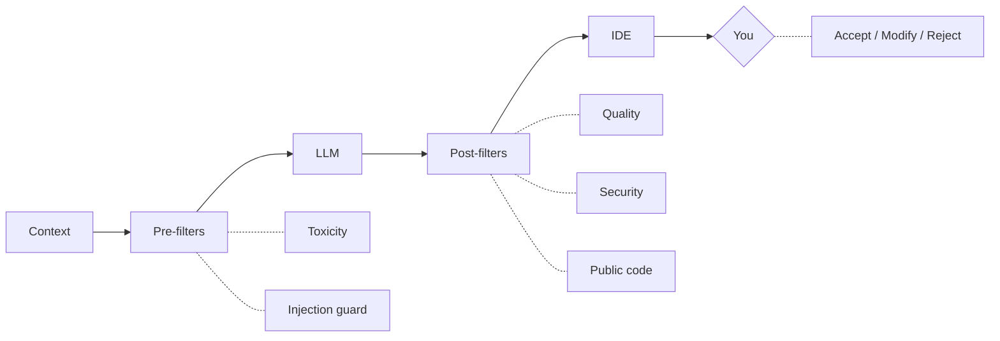

# The Request Lifecycle

Every time you press Tab or send a chat message, this happens:

Your code is **never** used for training. Prompts are deleted after inference.

<!--
This is the pipeline overview. Next slide has the timing details.
The diagram must stay compact - each box is one word or two max.
-->
