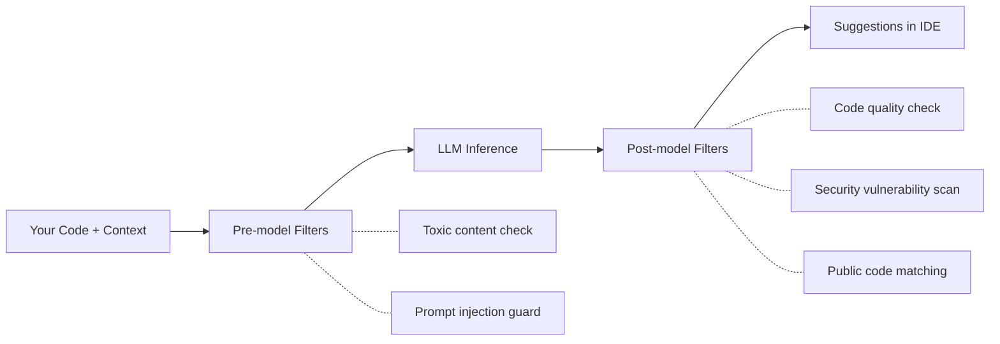

# How Copilot Fulfills a Request

<!--
What happens when Copilot processes a request:

1. Context assembly — Copilot gathers context from open tabs, current file, and chat history.
2. Pre-model filters — checks for toxic language, relevance, and prompt injection attempts.
3. LLM inference — the model generates suggestions, then deletes the prompt.
4. Post-model filters — code quality review, security scan (SQL injection, path injection), and optional public code matching.
5. Developer decides — accept, modify, or reject each suggestion.

Important: your code is never used to train the model. Data is encrypted in transit and at rest.
-->