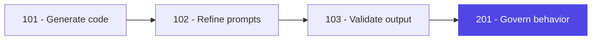

# From Validation to Governance

**103 taught you:** AI output is unreliable without verification.

**201 teaches you:** You can shift left - encode standards *before* generation, not after.

<!--
Bridge slide connecting modules.

103 → 201 is the critical transition:
- Reactive: generate, then validate, then fix.
- Proactive: govern inputs so outputs are consistent by default.

The maturity jump: from "individual developer validates" to "repository governs for everyone."
This is the engineering maturity model jump from "Individual" to "Governed."
-->
