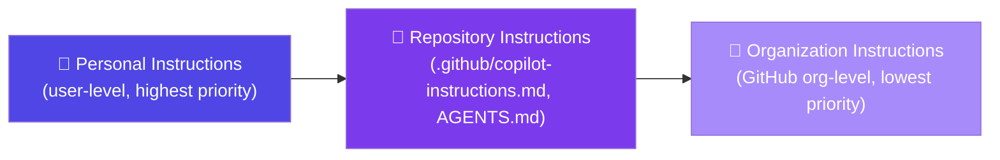

# Instruction Priority

Higher priority wins on conflict. All layers compose when they don't conflict.

**Personal** - developer preferences, editor behavior, personal style

**Repository** - team standards, architecture rules, conventions

**Organization** - security policies, compliance, shared libraries

<!--
Three layers, explicit precedence.

Most teams focus on Repository-level instructions - that's where engineering standards live.

Organization-level instructions are useful for security policies that apply everywhere
("never log PII", "always parameterize SQL").

Personal instructions are for individual workflow preferences ("I prefer verbose comments")
and should never contradict repository or org instructions.

The key rule: layers ADD to each other when compatible.
Higher priority OVERRIDES lower when there's a direct conflict.
-->
