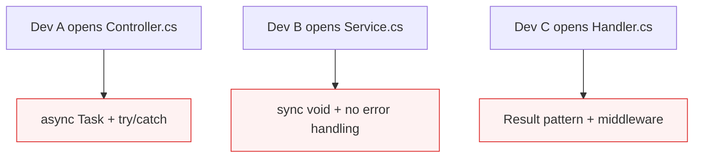
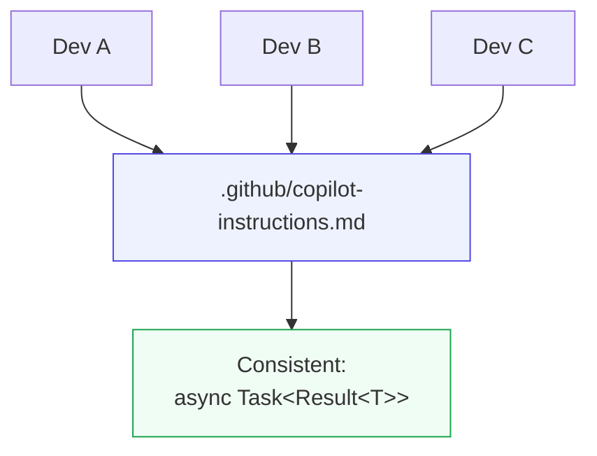

# Instructions Reduce Output Variance

::left::

## Without Instructions

Copilot mirrors whatever local pattern it sees.

::right::

## With Instructions

### Same standards. Same patterns. Same review expectations.

