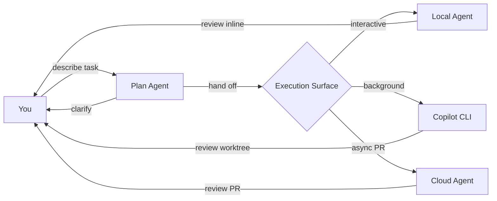

# Orchestration & Delegation Patterns

---

### Delegation boundaries

| **Delegate to agent** | **Keep for yourself** |
|---|---|
| Well-scoped implementation | Architecture decisions |
| Repetitive multi-file changes | Security-sensitive logic |
| Documentation generation | Business-critical flows |
| Test creation from specs | Ambiguous requirements |

<!--
Orchestration is about choosing the right surface for each sub-task.
The human stays responsible for strategy, security, and architecture.
Agents handle implementation within defined boundaries.
-->
