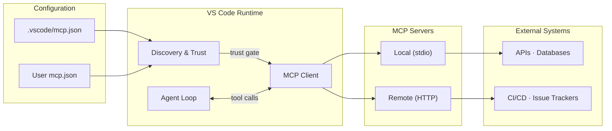

# MCP Architecture - Operational View

How tools flow from configuration to execution in your development environment.

The flow: **config → trust → client → server → external system.**

<!--
This replaces the protocol-focused architecture slide with an operational one.
The key gate is trust - nothing runs without explicit consent.
Transport comparison follows on the next slide.
-->