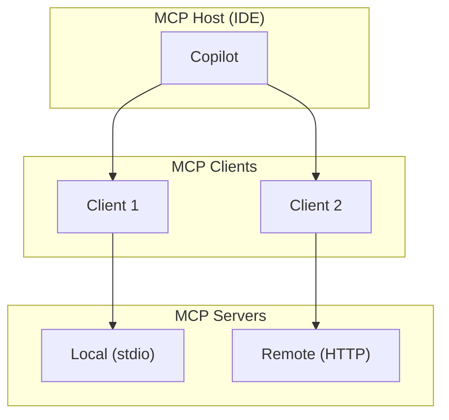

# MCP Architecture Deep Dive

::left::

## Transport Layer

| Transport | Use Case |
|---|---|
| **stdio** | Local servers, same machine |
| **Streamable HTTP** | Remote servers, cloud-hosted |

## Data Layer (JSON-RPC 2.0)

- **Lifecycle**: initialize, negotiate, close
- **Server features**: tools, resources, prompts
- **Client features**: LLM calls, user input, logs
- **Utilities**: notifications, progress tracking

::right::

## SDK Ecosystem

Tier 1: TypeScript, Python, Java, C#

Tier 2: Go, Kotlin, Swift

<!--
For most use cases, TypeScript or Python SDKs are the fastest path to a working server.

Local (stdio) servers are simplest — no network configuration needed.
Remote (HTTP) servers are needed for shared team infrastructure.
-->