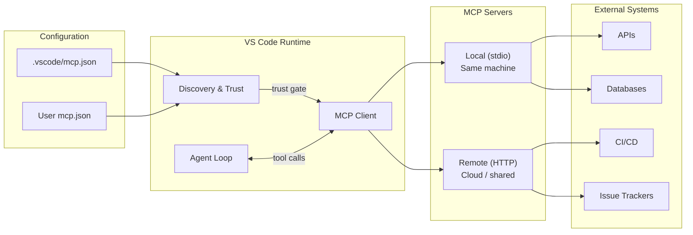

# MCP Architecture — Operational View

How tools flow from configuration to execution in your development environment.

| Transport | Runs | Use case | Example |
|---|---|---|---|
| **stdio** | Your machine | Personal tools, fast local access | Playwright, file-based servers |
| **HTTP** | Remote/cloud | Team infrastructure, shared services | GitHub, Azure DevOps |

<!--
This replaces the protocol-focused architecture slide with an operational one.
The flow: config → trust → client → server → external system.
The key gate is trust — nothing runs without explicit consent.
Local servers are simpler (no auth needed). Remote servers need OAuth/token auth.
-->