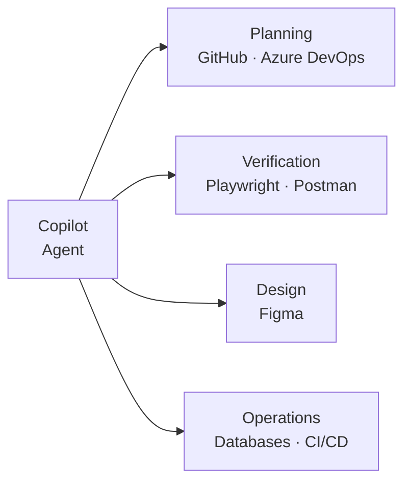

# Capability Expansion Pattern

Each MCP server adds a capability domain. The agent sequences them into workflows.

- **Planning:** read the ticket, understand requirements
- **Verification:** run tests, validate contracts
- **Design:** extract component specs, design tokens
- **Operations:** query data, trigger pipelines

<!--
This frames MCP servers not as "plugins" but as capability domains.
The agent orchestrates across domains to deliver complete workflows.
This is the agentic shift: from "AI writes code" to "AI drives delivery."
Implementation (code generation) is always handled by the core agent - it doesn't need an MCP server.
-->
