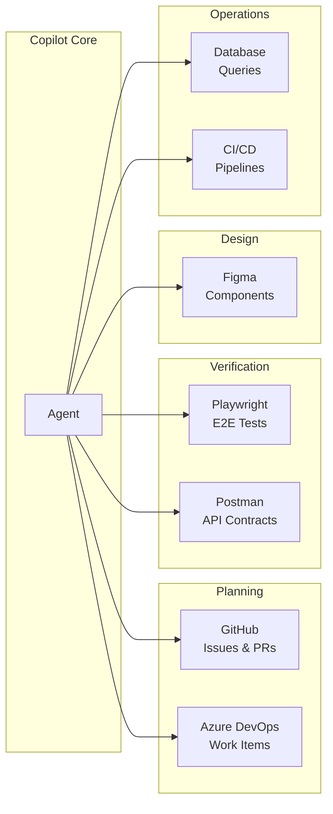

# Capability Expansion Pattern

Each MCP server adds a capability domain. Combined, they form an operational surface.

**The pattern:** each server handles one capability domain. The agent sequences them into workflows.

- **Planning:** read the ticket, understand requirements
- **Implementation:** generate code, apply patterns
- **Verification:** run tests, validate contracts
- **Delivery:** open PR, link to issue, trigger CI

<!--
This frames MCP servers not as "plugins" but as capability domains.
The agent orchestrates across domains to deliver complete workflows.
This is the agentic shift: from "AI writes code" to "AI drives delivery."
-->
