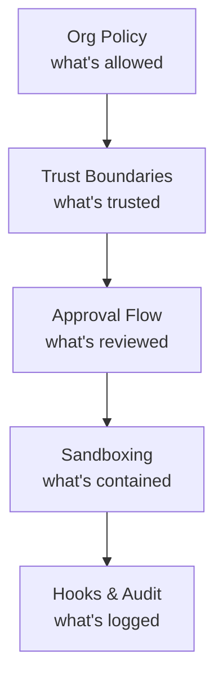

# Defense in Depth

Each security layer operates independently. Compromise of one doesn't bypass the others.

- **Org Policy** controls which tools and modes are available
- **Trust** gates server startup
- **Approvals** gate each tool invocation
- **Sandboxing** limits what can happen even if approved
- **Audit** logs what did happen

<!--
This complements the enterprise policy table.
The layered model means: even if one layer fails, the others still protect.
Start restrictive, widen as trust builds.
-->
