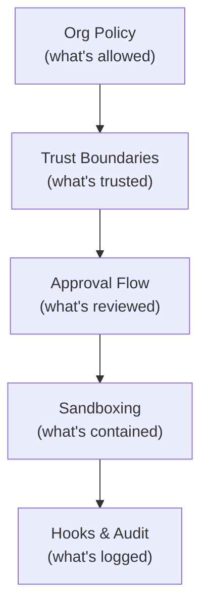

# Enterprise Security Controls

Organizations can enforce AI security policies across all developers.

| Policy | Effect |
|---|---|
| `ChatAgentMode` | Disable agent mode entirely |
| `ChatMCP` | Restrict to curated registry or disable MCP |
| `McpGalleryServiceUrl` | Point to private MCP registry |
| `ChatToolsAutoApprove` | Disable Bypass/Autopilot modes |
| `ChatToolsEligibleForAutoApproval` | Force manual approval for specific tools |
| `ChatToolsTerminalEnableAutoApprove` | Disable terminal auto-approval |

## Defense in Depth

Each layer operates independently. Compromise of one doesn't bypass the others.

<!--
Enterprise slide.
The message: you can adopt MCP without losing security control.
Policies are applied via device management (Intune, JAMF, etc.)
This enables progressive rollout: start restrictive, widen as trust builds.
-->
