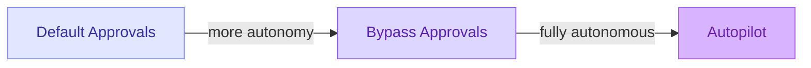

# Permission Levels

The permissions picker controls how much autonomy the agent has during a session.

| Level | Tool calls | Clarifying questions | Use case |
|---|---|---|---|
| **Default Approvals** | Shows confirmation | Asks when needed | Daily work - review everything |
| **Bypass Approvals** | Auto-approved | Asks when needed | Trusted project, fast iteration |
| **Autopilot** | Auto-approved | Auto-responded | Fully autonomous tasks |

 

**Security implication:** Bypass and Autopilot skip approval prompts for potentially destructive actions. Only use in sandboxed environments or with trusted tools.

<!--
This is the autonomy spectrum.
Default Approvals is the safe baseline. Autopilot is powerful but risky.
Enterprise orgs can disable Bypass/Autopilot via the ChatToolsAutoApprove policy.
-->
