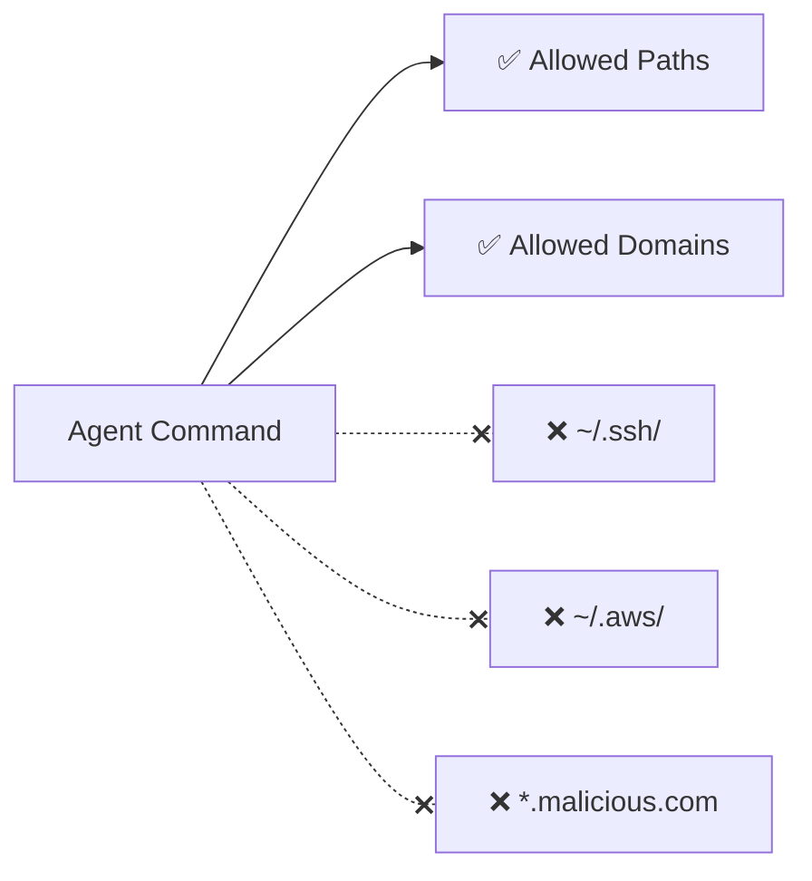

# Agent Sandboxing

OS-level isolation that restricts what agent-executed processes can access - regardless of approval.

**Key insight:** sandboxing shifts from "ask before doing" to **"can't do even if approved."**

When sandboxing is enabled, tool calls are auto-approved - because they physically cannot escape the sandbox.

Available on macOS and Linux (WSL2 on Windows).

<!--
This is the strongest protection available.
This is what enables safe Autopilot usage.
Kernel-level deny means even a compromised agent can't read SSH keys or cloud credentials.
-->
