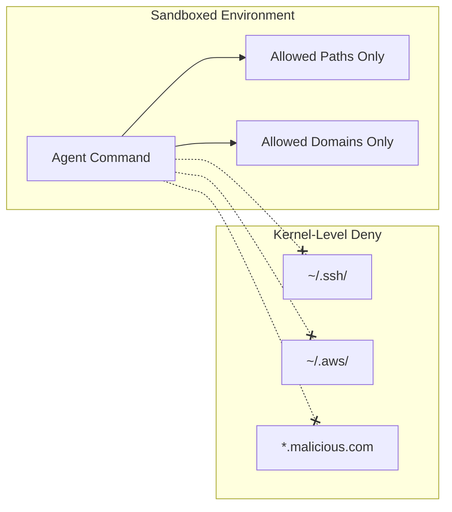

# Agent Sandboxing

OS-level isolation that restricts what agent-executed processes can access — regardless of approval.

**Key insight:** sandboxing shifts from "ask before doing" to "can't do even if approved."

**When sandboxing is enabled, tool calls are auto-approved** — because they physically cannot escape the sandbox.

<!--
This is the strongest protection available.
Currently macOS and Linux (WSL2 on Windows).
This is what enables safe Autopilot usage.
-->
