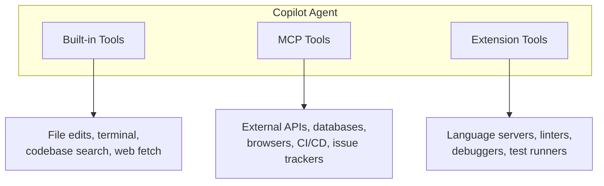

# Three Types of Tools

Copilot can use tools from three sources. Each has different trust, scope, and capabilities.

- **Built-in:** what Copilot can do out of the box
- **MCP:** how you extend Copilot to reach external systems
- **Extensions:** what VS Code extensions contribute to the agent

<!--
This is the mental model slide.
The key insight: MCP is the extensibility layer for connecting to YOUR infrastructure.
The comparison table follows on the next slide.
-->
