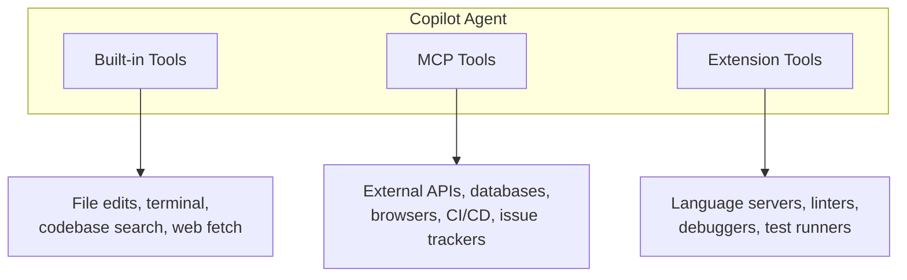

# Three Types of Tools

Copilot can use tools from three sources. Each has different trust, scope, and capabilities.

| | Built-in | MCP Servers | Extensions |
|---|---|---|---|
| **Source** | VS Code core | `mcp.json` / registry | Marketplace |
| **Scope** | Workspace files | Any system | IDE features |
| **Trust** | Always available | Explicit trust | Publisher trust |
| **Sharing** | Automatic | Commit `mcp.json` | Team installs |
| **Sandboxing** | Workspace-limited | Configurable | Extension host |

<!--
This is the mental model slide.
Built-in tools: what Copilot can do out of the box.
MCP tools: how you extend Copilot to reach external systems.
Extension tools: what extensions contribute to the agent.

The key insight: MCP is the extensibility layer for connecting to YOUR infrastructure.
-->
