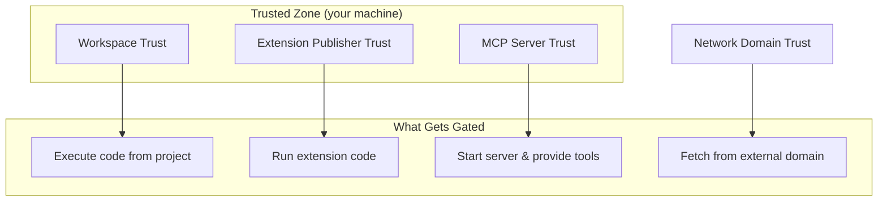

# Trust Boundaries

Every MCP interaction crosses a trust boundary. VS Code enforces explicit consent at each layer.

**Each boundary requires explicit consent before crossing.**

- **Workspace** - untrusted projects run in restricted mode, agents disabled
- **Extension publisher** - prompted before activation
- **MCP server** - prompted before first start and after config changes
- **Network domain** - prompted before fetching external content

<!--
This is NOT just about MCP. It's the full security model.
The point: trust is layered, not binary. Each layer can be revoked independently.
Attendees should understand that opening a repo with an mcp.json does NOT auto-run those servers.
-->
