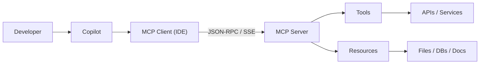

# How MCP Connects

MCP servers expose two kinds of capabilities:

- **Tools** - actions (create PR, run query, build container)
- **Resources** - data (files, docs, database records)

<!--
This is the protocol flow: Developer → Copilot → MCP Client → MCP Server → External systems.
The client lives in the IDE. The server can be local or remote.
Tools are actions the agent can invoke. Resources are data the agent can read.
-->
