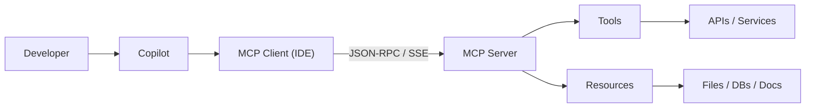

# Model Context Protocol (MCP)

::left::

## What

An open standard for securely connecting AI assistants to external tools and data sources.

Think of MCP like a **USB-C port** for AI — a standardized way to connect any tool or data source.

## Key Properties

- Open standard, not vendor-specific
- JSON-RPC 2.0 based protocol
- Supported in VS Code, Visual Studio, JetBrains
- Works with Copilot Chat and Coding Agent

::right::

MCP servers expose:
- **Tools** — actions (create PR, run query, build container)
- **Resources** — data (files, docs, database records)

<!--
MCP is the extensibility layer for Copilot.

Without MCP: Copilot knows your code.
With MCP: Copilot knows your code + your tools + your data.

For Copilot Business/Enterprise: enable the "MCP servers in Copilot" policy.
-->