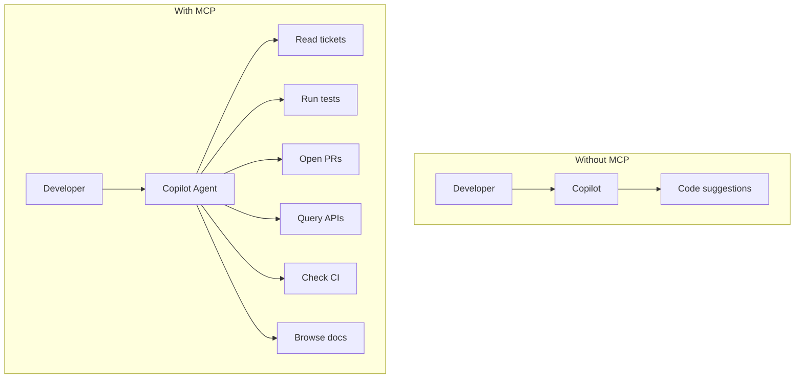

# How MCP Changes AI Workflows

MCP shifts Copilot from **code assistant** to **workflow operator**.

<!--
This is the conceptual shift slide.
Before MCP: Copilot is a fast typist.
After MCP: Copilot is a workflow participant that can read, act, and validate across systems.
The value isn't "more tools" - it's "connected workflows."
-->
