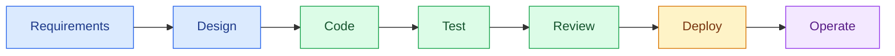

# Why AI Changes the SDLC

- **Requirements**: Draft, refine, challenge
- **Design**: Explore, prototype, validate
- **Code**: Generate, refactor, migrate
- **Test**: Generate, expand coverage
- **Review**: First-pass analysis
- **Deploy**: Config generation
- **Operate**: Diagnose, summarize

Before AI: humans execute every step.

With AI: humans **decide**, AI **executes** — under constraints.

**The shift is structural.**

The SDLC becomes the **control surface** for AI.

💬 **Where in our SDLC does AI create the most value today? Where does it create the most risk?**

<!--
This is the foundational reframe.

AI doesn't replace the SDLC — it transforms every phase.
The question is no longer "should we use AI?" but "how do we govern AI across the entire lifecycle?"

The risk profile is different in each phase:
- Code generation risks are well understood (wrong implementation)
- Requirements risks are subtle (confident but vague specs)
- Review risks are dangerous (rubber-stamping)
- Operations risks involve data sensitivity

Ask attendees to reflect on their own experience from modules 101–302.
-->
