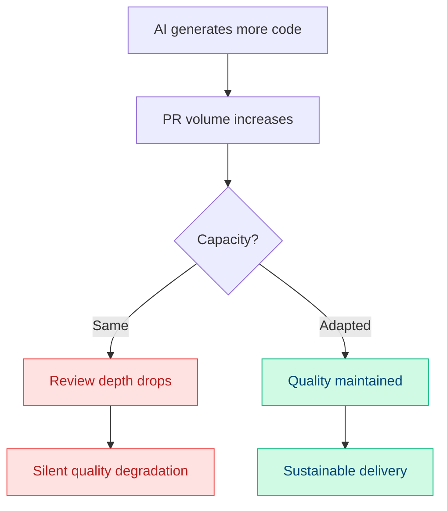

# AI Code Review at Scale

**AI handles:**
- Mechanical checks (style, formatting)
- Missing tests or docs detection
- Pattern violation flagging

**Humans retain ownership of:**
- Logic and algorithmic correctness
- Architectural fit
- Business correctness
- Production risk assessment

**Warning signals:**
- PRs approved without comments ↑
- Review time drops faster than PR size ↓
- Bug escape rate to production ↑

💬 **Has AI-assisted development changed your team's review patterns? How?**

<!--
AI code review changes the bottleneck, not just the speed.

When AI generates more code, PR volume increases.
If reviewer capacity stays the same and review time drops,
that's not efficiency — it's a risk indicator.

The approval criteria for AI-generated code must be explicit:
- What constitutes a meaningful review?
- When is human judgment required vs optional?
- What review depth is expected for AI-generated vs human-written code?

AI review should reduce noise, not replace judgment.

Metrics to watch:
- Substantive comment rate per PR
- Rework volume after review
- Bug escape rate trends
-->
