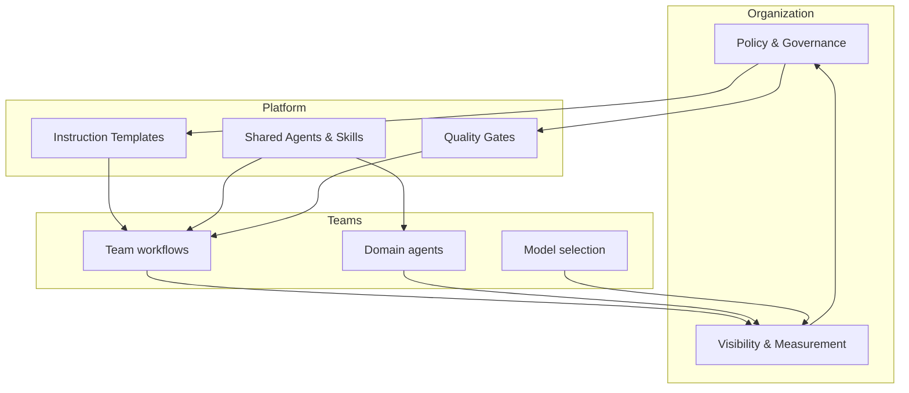

# AI Operating Model

---

# AI Operating Model

💬 **What should our organization centralize vs leave to teams?**

<strong>Centralize</strong> 
Data policy · Approved tools · Quality gates · Budget caps

<strong>Enable</strong> 
Instruction templates · Shared agents · Platform integrations

<strong>Decentralize</strong> 
Workflow design · Agent configuration · Model selection · Team conventions

<!--
The operating model answers: who owns what?

Organization level: hard constraints that apply everywhere.
Platform level: shared enablement that reduces duplication.
Team level: freedom to optimize for their domain and workflow.

This maps directly to the workshop progression:
- Modules 201–203 taught the team layer (instructions, agents, AI-ready repos)
- Modules 301–302 taught the platform layer (MCP, spec-driven development)
- Module 303 addresses the organizational layer

The feedback loop matters:
teams produce visibility data → organization refines policy → platform evolves enablement → teams benefit.

Without the loop, governance becomes stale and teams work around it.
-->
