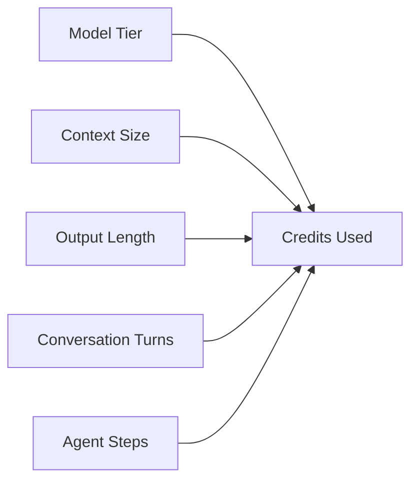

# What Drives AI Credit Consumption

**High-cost patterns:**
- Long agent sessions with large context
- Frontier models for routine tasks
- Unfocused conversations without clear intent
- Vague instructions causing retries

**Low-cost patterns:**
- Autocomplete (zero credits)
- Short, well-scoped prompts
- Lightweight models for iteration
- Plan mode before Agent mode

<!--
Credits scale with: model tier × (input tokens + output tokens).
Agent mode multiplies this by the number of internal steps.
Context engineering is cost engineering.
-->
