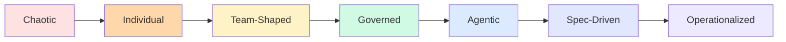

# Engineering Maturity Progression

<strong>Chaotic → Individual</strong> 
Autocomplete, inline prompting, experimentation. No governance. Module 101–102.

<strong>Team-Shaped → Governed</strong> 
Instruction files, ADRs, conventions, reusable patterns. Module 201–203.

<strong>Agentic → Spec-Driven</strong> 
Delegated workflows, planning-first, validation loops. Module 202, 301–302.

<strong>Operationalized</strong> 
Governance, visibility, budgets, rollout, platform enablement. Module 303.

Most organizations have teams at different stages simultaneously. That's normal. The goal is progressive evolution, not uniform compliance.

<!--
This maps directly to the workshop progression.
Each module teaches the practices needed at that maturity stage.
Module 303 is the organizational layer that makes the rest sustainable.
-->
