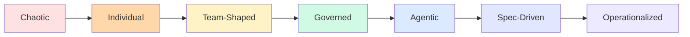

# Workshop Progression vs Enterprise Maturity

These are two different models. The workshop progression maps the training content. The AI SDLC maturity model maps your organization.

<strong>Chaotic → Individual</strong> 
Autocomplete, inline prompting, experimentation. Module 101–102.

<strong>Team-Shaped → Governed</strong> 
Instruction files, ADRs, conventions, reusable patterns. Module 201–203.

<strong>Agentic → Spec-Driven</strong> 
Delegated workflows, planning-first, validation loops. Module 202, 301–302.

<strong>Operationalized</strong> 
Governance, visibility, budgets, rollout, platform enablement. Module 303.

This is the <strong>workshop content map</strong>. The AI SDLC maturity model on the previous slide maps how organizations operationalize AI - these are complementary, not the same thing.

<!--
This is the workshop repository progression - how the training modules build on each other.

Do not confuse this with the five-level AI SDLC maturity model.
That model describes how an organization integrates AI safely and effectively.
This one describes what the training covers and in what order.

Both are useful frames. They answer different questions.
-->

