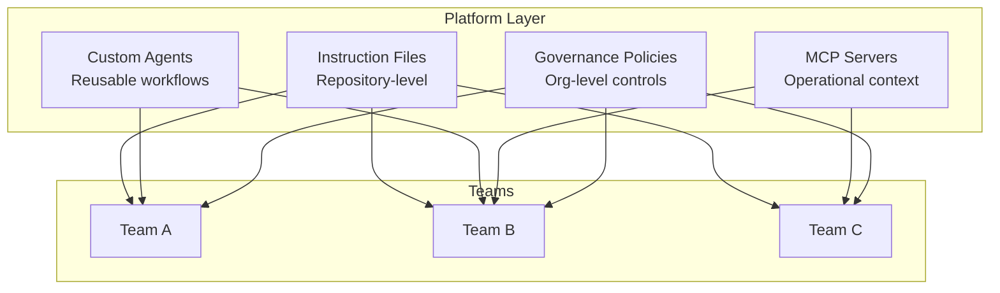

# AI Platform Enablement

The platform team's job: make AI productive AND governable for every engineering team.

**Platform provides:** shared agents, instruction templates, model policies, budget guardrails, MCP integrations.  
**Teams own:** their instruction files, domain agents, workflow design, model selection for their tasks.

<!--
Centralize governance. Decentralize execution.
The platform enables. Teams deliver.
-->
