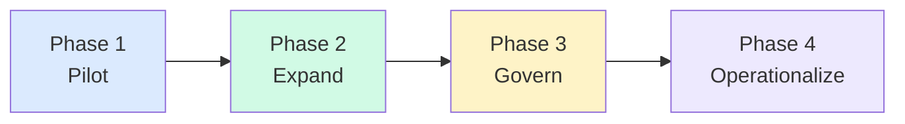

# Phased Rollout Pattern

<strong>Pilot</strong> 
5-15 developers 
Measure adoption 
Identify friction 
No governance yet

<strong>Expand</strong> 
Team-level rollout 
Add instruction files 
Establish conventions 
First usage reviews

<strong>Govern</strong> 
Org-wide policies 
Budget controls 
Data handling rules 
Approved tool list

<strong>Operationalize</strong> 
Usage dashboards 
Workflow standards 
Agent governance 
Continuous optimization

<!--
Do not roll out to everyone simultaneously.
Pilot, learn, iterate, expand.
Each phase adds governance proportional to scale.
-->
