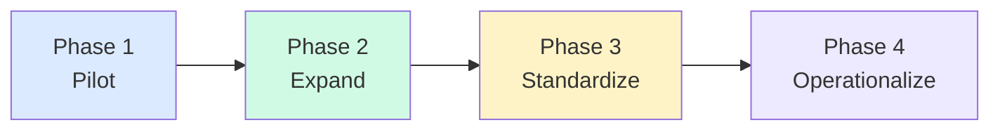

# Phased Rollout Pattern

<strong>Pilot</strong> 
5–15 developers 
Measure adoption and friction 
Define approved tools and data rules 
Capture baseline metrics

<strong>Expand</strong> 
Team-level rollout 
Instruction files in repos 
First reusable prompts and agents 
First usage reviews

<strong>Standardize</strong> 
Shared practices and conventions 
Review expectations defined 
Model strategy established 
Quality metrics tracked

<strong>Operationalize</strong> 
Usage dashboards live 
Budget controls active 
Policy review cadence 
Continuous optimization

<!--
Governance does not start after expansion. It starts small and deepens with each phase.

Pilot phase must already include:
- approved tool list
- basic data handling rules
- baseline metrics capture

Do not wait until you have 100 developers using AI to define how it should be used.
By then, shadow practices are already established and hard to change.
-->

