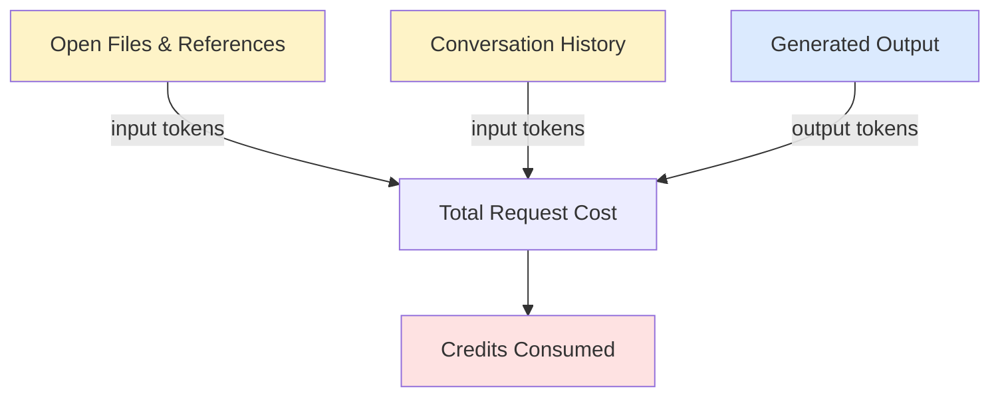

# Context Size Is Cost

**What inflates context:**
- Many open files without relevance
- Long conversations without restarting
- Entire repositories as references
- Verbose previous outputs accumulating

**Practical controls:**
- Start fresh sessions for new tasks
- Close irrelevant files before prompting
- Use `.github/copilot-instructions.md` to encode context once
- Prefer Plan mode → then Agent mode

<!--
Engineers rarely think about token volume.
But context engineering is cost engineering at scale.
A team of 50 developers with poor context hygiene can consume 3-5x more credits than one with good practices.
-->
